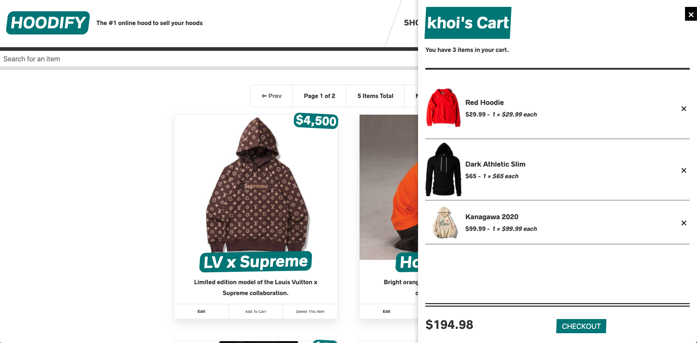

# HOODIFY
*The #1 online hood to sell your hoods.*

A simple light-hearted ecommerce web application where users can buy and sell hoodies.



## Live Link

[View Hoodify live!](https://hoodify-next-prod.herokuapp.com/)

## Features (backend)
* Built with GraphQL Yoga, Prisma and Express
* Custom resolvers for GraphQL queries and mutations
* Schema definition & data relationships for users, items, cart items, carts and orders
* Sending emails & credit card checkout (Stripe)
* User accounts, authentication (JWT), permissions
* Prisma and Yoga servers deployed on Heroku

## NOTE
Certain functionalities are still linked to development services:
* Emails are still set to be sent to a fake SMTP testing server.
* Credit card checkout can only be done with fake values. Please **only** use the following:
```
credit card number: 4242 4242 4242 4242
expiry date: any future date
cvc: any 3 digits
